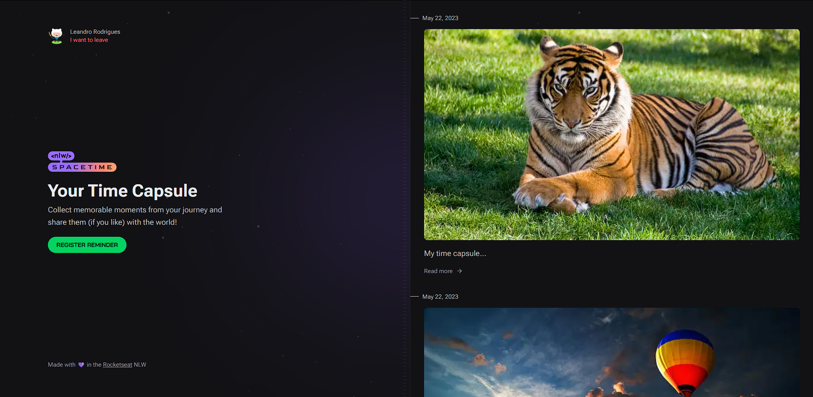

# Space Time - Treasure your memories 💾

<br>

<p align="center">
  <a href="#-about-the-project">About the project</a> •
  <a href="#-technologies">Technologies</a> •
  <a href="#-getting-started">Getting started</a> •
  <a href="#-license">License</a>
</p>

<p align="center">
 
 
  
</p>

## 👩‍💻 About the project

Time Capsule Application, where the user can add texts, photos, and videos of significant events in their life to a timeline, organized by month and year.

This is a full-stack project, consisting of separate folders for the front-end, back-end and mobile components. Each folder contains the dependencies and scripts needed to develop and build the application.

In order to use the application, you'll need to run the server and the web or mobile application.

- For detailed information about all the technologies used in the project, please see: <a href="#-technologies">Technologies</a>.
- For a detailed guide on how to run the project on your machine, follow the guide at: <a href="#-getting-started">Getting started</a>.

Project developed during [Rocketseat's](https://rocketseat.com.br/) #Next-Level-Week-12

## 🖥 Project Demonstration


<br/>


## 🔖 Layout

You can view the project layout through the links below:

- [Layout in Figma](<https://www.figma.com/file/yXPDSnxAlXXju0mnNcJD0b/C%C3%A1psula-do-tempo-%E2%80%A2-Trilha-Ignite-(Community)-(Copy)?type=design&node-id=205-3&t=d4zNfyK8VPMsXtmq-0>)

> Remembering that you need to have a [Figma](http://figma.com/) account to access it.

## 🚀 Technologies

The application utilizes a range of technologies:

- Front-end:

  - [Next.js 13](https://nextjs.org/) framework for server-side rendering and React development.
  - [Tailwind CSS](https://tailwindcss.com/) for responsive and customizable styling.
  - [Axios](https://axios-http.com/ptbr/docs/intro) for making HTTP requests.
  - [Day.js](https://day.js.org/en/) for manipulating dates.
  - [JWT Decode](https://www.npmjs.com/package/jwt-decode) for decoding JSON Web Tokens.
  - [Lucide React](https://lucide.dev/) for SVG icons.

- Back-end:

  - [Fastify](https://www.fastify.io/), a fast and low-overhead web framework for Node.js.
  - [Prisma](https://www.prisma.io/) as an ORM (Object-Relational Mapping) tool.
  - [Zod](https://github.com/colinhacks/zod) for runtime type checking.
  - [dotenv](https://www.npmjs.com/package/dotenv) for loading environment variables.
  - [Axios](https://axios-http.com/ptbr/docs/intro) for handling HTTP requests.

- Mobile:

  - [Expo](https://expo.dev/), a framework and platform for building universal applications.
  - [React Native](https://reactnative.dev/) for cross-platform mobile development.
  - Expo modules such as expo-auth-session, expo-constants, expo-image-picker, and expo-secure-store for various functionalities.
  - [NativeWind](https://www.nativewind.dev/) for styling with Tailwind CSS in React Native.
  - [React Native SVG](https://www.npmjs.com/package/react-native-svg) for SVG support.

## 💻 Getting started

### Requirements

- [Node.js](https://nodejs.org/en/)
- [Yarn](https://classic.yarnpkg.com/) or [NPM](https://www.npmjs.com/) _(examples are with NPM)_
- The project uses the github OAuth application for the user to log in. To be able to fill in your own environment variables, follow this guide: [OAuth](https://docs.github.com/pt/apps/oauth-apps/building-oauth-apps/creating-an-oauth-app)

**Clone the project and access the folder**

```bash
$ git clone https://github.com/leandrorodrigues00/space-time && cd space-time

```

**Follow the steps below to start the server**

```bash
# Install the dependencies
$ cd server
$ npm i

# Make a copy of '.env.example' to '.env'
# and set with YOUR environment variables.
$ cp .env.example .env


# Start the app
$ npm run dev

# Your server will be available at the URL http://localhost:3333
```

**Follow the steps below to start the web application**

```bash
# Install the dependencies
$ cd space-time\web
$ npm i

# Make a copy of '.env.example' to '.env'
# and set with YOUR environment variables.
$ cp .env.example .env


# Start the app
$ npm run dev
```


**Follow the steps below to start the mobile application**

```bash
# Install the dependencies
$ cd space-time\mobile
$ npm i

# Start the app
$  npx expo start 
```


## 📝 License

This project is licensed under the MIT License - see the [LICENSE](LICENSE) file for details.

---

<p align="center">
  Made with 💜&nbsp; by  Leandro Rodrigues
</p>
